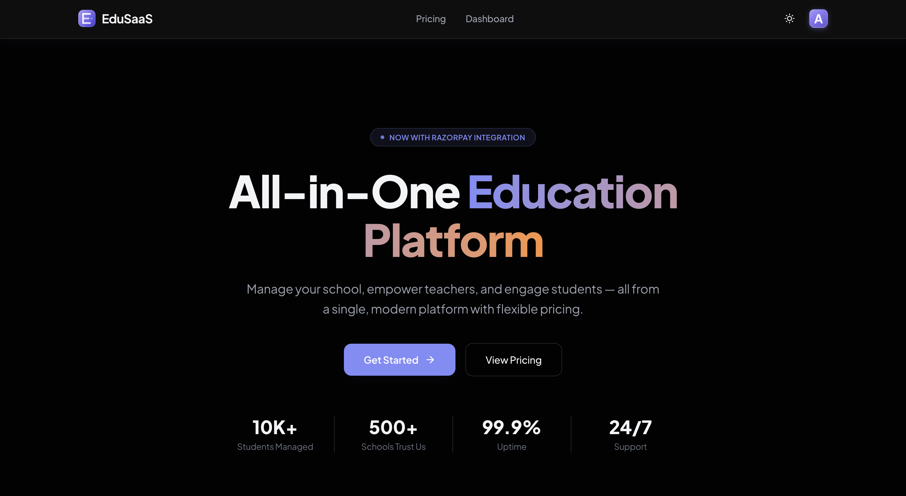
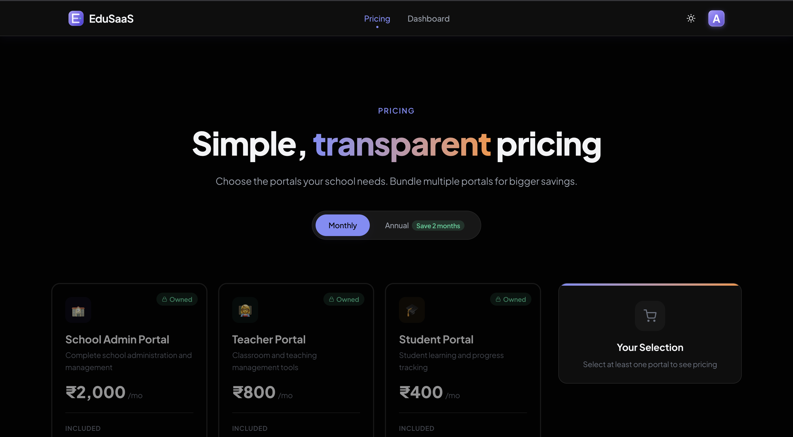
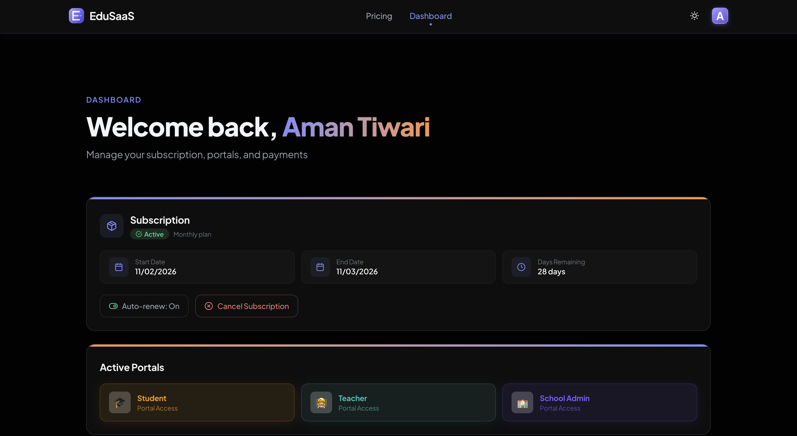
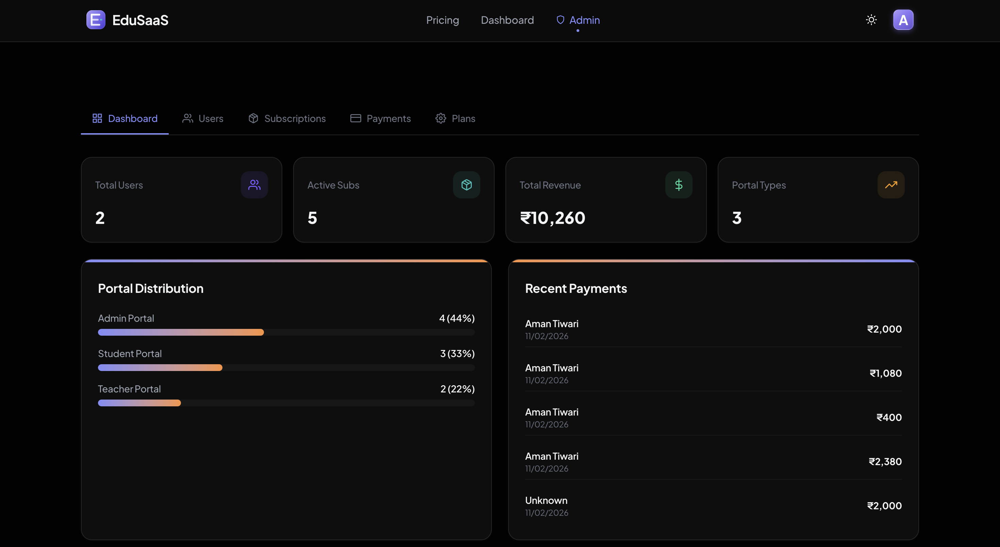
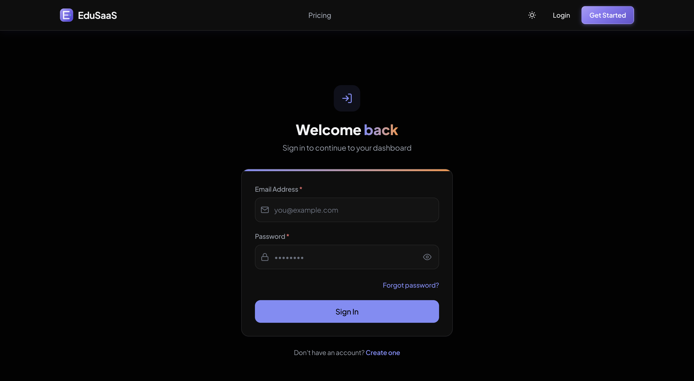
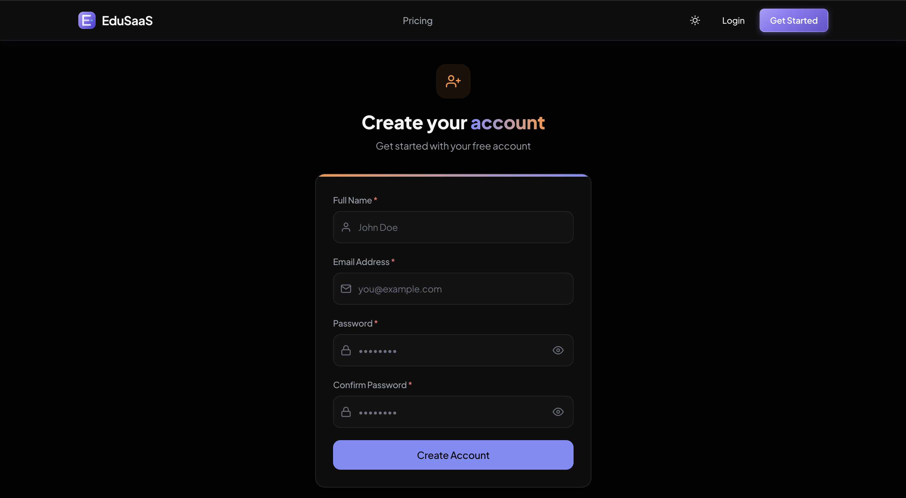

# EduSaaS — SaaS Platform with Razorpay Integration

> **Technical Assignment** — A full-stack SaaS platform for educational institutions with dynamic pricing, Razorpay payments, and role-based dashboards.

**Live Demo:** [edu-saas-two.vercel.app](https://edu-saas-two.vercel.app)

---

## Tech Stack

| Layer | Technologies |
|-------|-------------|
| **Frontend** | React 19, TypeScript, Vite, Tailwind CSS v4, Framer Motion, TanStack Query v5 |
| **Backend** | Node.js, Express.js, TypeScript |
| **Database** | MongoDB (Mongoose ODM), hosted on MongoDB Atlas |
| **Auth** | JWT (Access + Refresh Tokens), bcrypt, email verification |
| **Payments** | Razorpay SDK (Test Mode) |
| **Email** | Nodemailer + Brevo SMTP |
| **Deployment** | Vercel (frontend), Render (backend) |

---

## Features Implemented

### Core Requirements

- **User Authentication** — Register, login, JWT-based sessions with auto-refresh, logout
- **3 SaaS Portals** — School Admin, Teacher, and Student portals with customizable features
- **Dynamic Pricing** — Prices update in real-time based on selected portals, features, and billing cycle (monthly/annual)
- **Razorpay Checkout** — Full integration with order creation, signature verification, and webhook handling
- **Payment History** — All transactions stored and viewable with subscription data
- **User Dashboard** — View purchased portals, subscription status, and plan details
- **Admin Panel** — Manage users, view payments, track subscriptions, edit plans and pricing

### Bonus Features

- ✅ Email verification (Brevo SMTP)
- ✅ Password reset flow
- ✅ Dark mode (default theme)
- ✅ Animations & transitions (Framer Motion)
- ✅ Role-based dashboards (User / Admin)
- ✅ Admin pricing management
- ✅ Responsive design (mobile, tablet, desktop)

---

## Screenshots

### Landing Page


### Pricing Page


### User Dashboard


### Admin Panel


### Authentication
| Login | Sign Up |
|-------|---------|
|  |  |

---

## Architecture

```
EduSaaS/
├── backend/
│   └── src/
│       ├── config/         # DB connection, Razorpay, pricing config
│       ├── controllers/    # Auth, User, Admin, Payment, Pricing
│       ├── middleware/     # JWT auth guard
│       ├── models/         # User, Subscription, Payment, Order
│       ├── routes/         # API route definitions
│       ├── services/       # Email service
│       └── utils/          # Zod validation schemas
│
└── frontend/
    └── src/
        ├── components/     # UI components (layout, common, pricing)
        ├── context/        # Auth & Toast contexts
        ├── hooks/          # Custom hooks
        ├── pages/          # Page components + admin/
        └── services/       # API service layer
```

### API Endpoints

| Area | Key Endpoints |
|------|--------------|
| **Auth** | `POST /auth/register`, `POST /auth/login`, `POST /auth/refresh-token`, `GET /auth/verify-email` |
| **User** | `GET /user/dashboard` |
| **Pricing** | `GET /pricing/all`, `POST /pricing/calculate` |
| **Payment** | `POST /payment/create-order`, `POST /payment/verify` |
| **Admin** | `GET /admin/dashboard`, `GET /admin/users`, `GET /admin/payments`, `PUT /admin/pricing` |

---

## Getting Started

### Prerequisites

- Node.js v18+
- MongoDB (local or Atlas)
- Razorpay account (test mode)

### Setup

```bash
# Clone
git clone https://github.com/amant8183/EduSaaS.git
cd EduSaaS

# Backend
cd backend
npm install
cp .env.example .env    # configure your env vars
npm run dev

# Frontend (new terminal)
cd frontend
npm install
npm run dev
```

### Environment Variables (Backend `.env`)

```env
PORT=5000
MONGO_URI=mongodb+srv://...
JWT_SECRET=your_secret
RAZORPAY_KEY_ID=rzp_test_...
RAZORPAY_KEY_SECRET=...
BREVO_SMTP_HOST=smtp-relay.brevo.com
BREVO_SMTP_PORT=587
BREVO_SMTP_USER=...
BREVO_SMTP_PASS=...
FROM_EMAIL=your@email.com
FRONTEND_URL=http://localhost:5173
```

---

## Razorpay Test Credentials

| Method | Details |
|--------|---------|
| **UPI (Success)** | `success@razorpay` |
| **UPI (Failure)** | `failure@razorpay` |
| **Visa** | `4111 1111 1111 1111` — Any CVV, any future expiry |
| **Mastercard** | `5104 0155 5555 5558` — Any CVV, any future expiry |

---

## Deployment

| Service | Platform | URL |
|---------|----------|-----|
| Frontend | Vercel | [edu-saas-two.vercel.app](https://edu-saas-two.vercel.app) |
| Backend | Render | [edusaas.onrender.com](https://edusaas.onrender.com) |
| Database | MongoDB Atlas | — |

---

## License

ISC

---

Built by [Aman Tiwari](https://github.com/amant8183)
